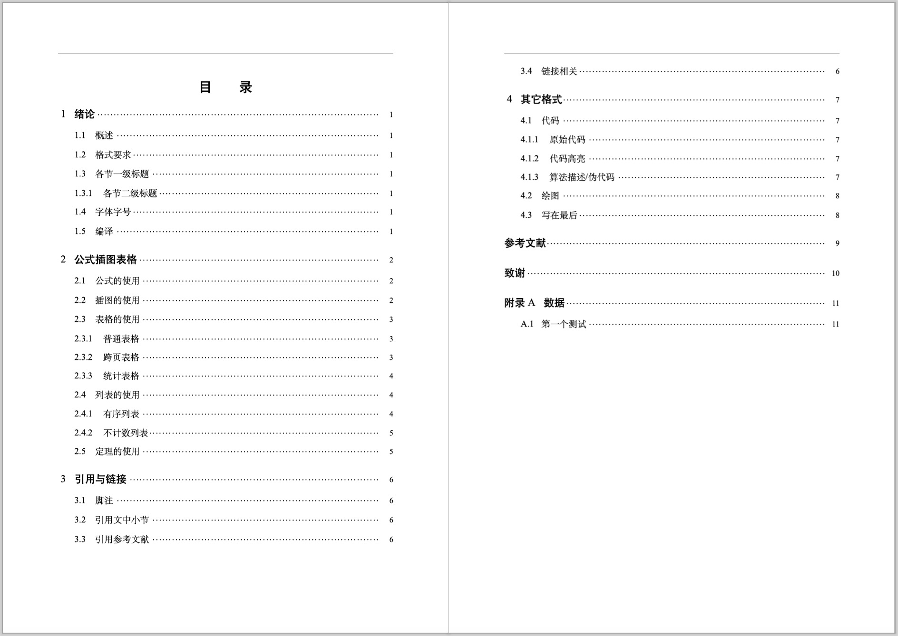

# 武汉大学本科毕业设计（论文）LaTeX 模板

本项目为武汉大学本科毕业设计（论文）LaTeX 模板。本模板在 whu-thesis 2019 版的基础上进行修改以符合 2021 级（2025届）国家网络安全学院的要求。

## 样例展示

完整样例请查看 demo.pdf。

## 注意事项

1. 本模板需使用 XeLaTeX 进行编译，支持本地及在线编译。
2. 请注意本模板**未经任何学校相关部门审核**，使用前请仔细斟酌。如有出入请以官方 Word 模板为准。
3. 模板仅供学习交流使用，任何由使用本模板引起的问题与 whu-thesis 及本人无关。

## 致谢

武汉大学毕业论文 LaTeX 模板：[whu-thesis](https://github.com/whutug/whu-thesis)

## Todoss
- [x] 调整图片标题样式
- 格式
    - [x] 标点符号（引号）检查
    - [x] “一二三”说全
    - [x] 附录的内容都放前面，评分体系放前面，
    - [x] 脚注尽量不出现
    - [x] 确保chapter、section、subsection之间都有文本过渡
- 内容
    - [x] 研究内容不是具体方法，要从需求的角度，参考研究内容的图来说，后面可以加上一段来简单描述“最终采用的技术”，最后讲contribution，
    - [x] 研究内容的图画错了
    - [x] 评分体系怎么来：加几个引用，说明不是拍脑袋想的
    - [x] 加贡献（独特的点）： 优化
- 实验
    - [ ]Sim 再改进改进？可否更好？尤其是Sim-Intra。至于Sim-Inter
    - [x]举多几个例子：文图输出+优化不考虑输入 --> 和用户输入对不上
    - [x]文图实验再跑多一些
    - [ ]答辩给点有意思的