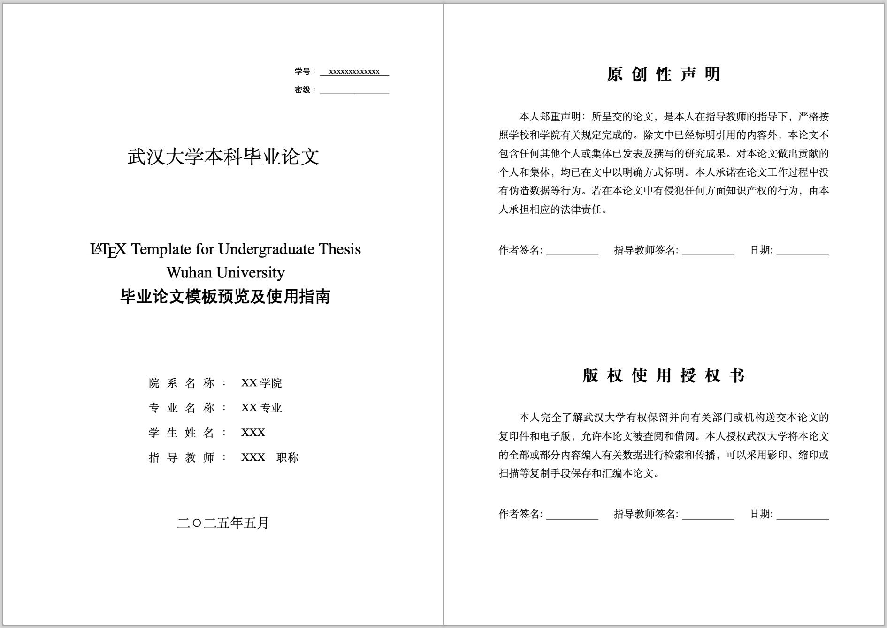
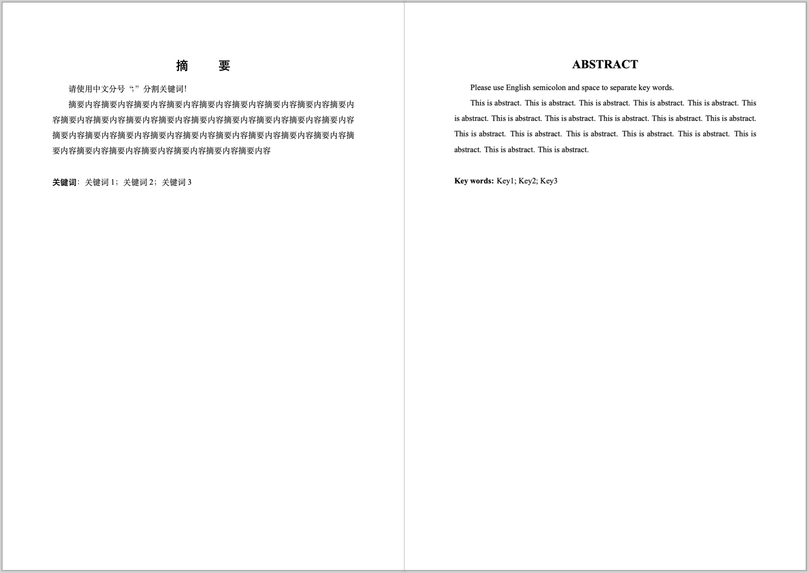

# 武汉大学毕业设计（论文）LaTeX 模板

本项目为武汉大学本科生毕业设计（论文） $\LaTeX$ 模板。本模板在 whu-thesis 2019 版的基础上进行修改以符合 2021 级（2025届）国家网络安全学院的要求。

## 样例展示

完整样例： [PDF 样例文档](https://github.com/AaronComo/WHU-Bachelor-Thesis-Template/demo.pdf)

## 注意事项

1. 本模板需使用 XeLaTeX 进行编译，支持本地及在线编译
2. 请注意本模板**未经任何学校相关部门审核**，使用前请仔细斟酌。如有出入请以官方 Word 模板为准。
3. 模板仅供学习交流使用，任何由使用本模板引起的问题与 whu-thesis 及本人无关。

## 致谢

武汉大学毕业论文 LaTeX 模板：[whu-thesis](https://github.com/whutug/whu-thesis)
